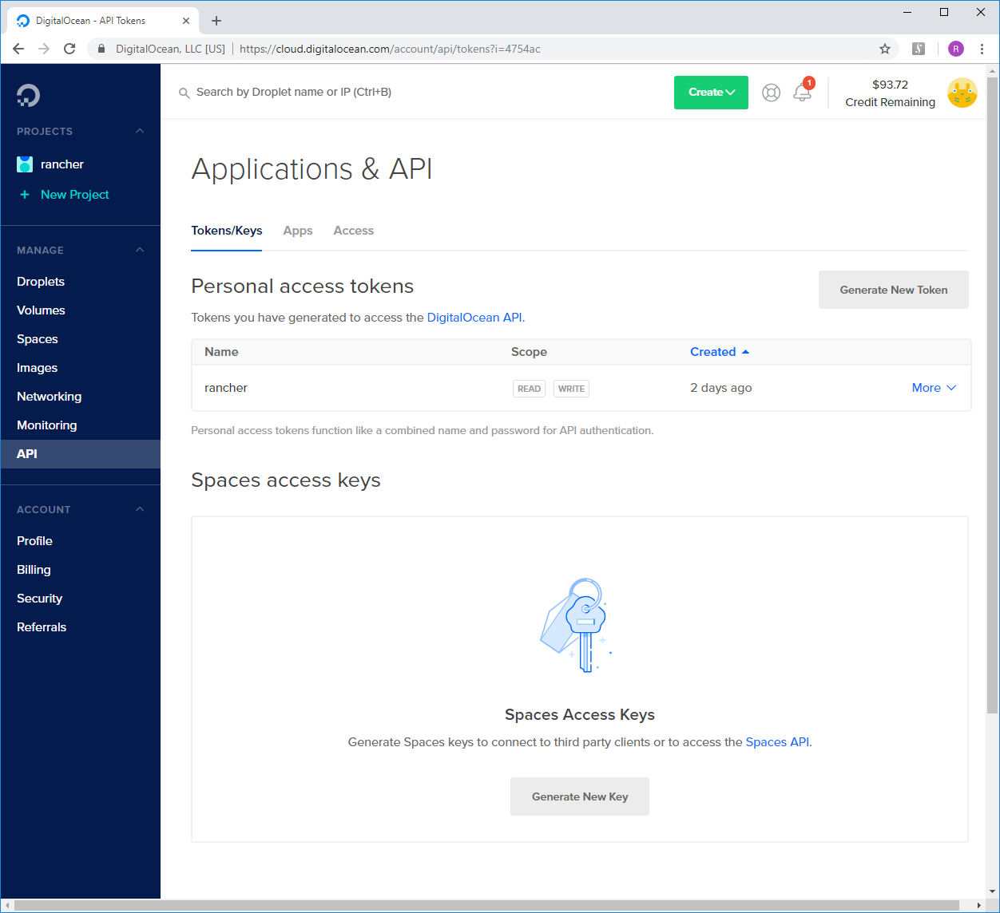

create a cluster
================

now we are ready to create the first cluster. there are various options on how to create one, which are outlined here.

goals
-----

in this section we are looking to achieve the following goals:

* get familiar with supported cluster types
* learn about cluster node roles
* provision the first cluster using the node provider do (digitalocean)

cluster types
-------------

* **hosted k8s:** a cloud managed k8s cluster, currently [google gks](https://cloud.google.com/kubernetes/),
    [amazon eks](https://aws.amazon.com/de/eks/) and [microsoft azure](https://azure.microsoft.com/en-us/services/kubernetes-service/)
    are supported as k8s cluster providers.
* **node provider:** VMs provisioned and managed by rancher itself using a so-called node provider. a list of supported node providers can be
    found via toolbar under *Global / Node Providers*.
* **custom:** self-provisioned nodes (metal / vm) that can be integrated by starting an initializer available as an ephemeral docker container.
    a ready-made `docker run` command that has all necessary parameters for a new node to connect to rancher can be copied from the gui.
* **imported:** existing k8s clusters can be imported into rancher, which allows to manage workloads on it.

we will create a cluster using the node provider *do*. however, feel free to try using other cluster types.

se also:

* https://rancher.com/docs/rancher/v2.x/en/cluster-provisioning/#cluster-creation-options

cluster node roles
------------------

each cluster contains three types of nodes, which are:

* **etcd nodes:** nodes running an [etcd](https://coreos.com/etcd/) server, which is the heart of each k8s cluster. it is a distributed key-value store which used to save the current cluster state in a fault-tolerant way.
    you will need at least one etcd node (or more for redundancy), an odd number of nodes is recommended to maintain a quorum in cases of network partitioning (aka split-brain)
* **control plane nodes:** nodes running the k8s api server, scheduler and controller manager. these nodes basically make sure the current effective cluster state will eventually be equal to
    what's contained in etcd. you need at least one (or more for redundancy) of these.
* **worker node:** as somebody also has to do the work, you also need nodes to run your workloads. obviously, you need at least one (or more for redundancy).

there are no restrictions on combining node roles, so a single-node cluster is possible (recommended only for development and/or testing purposes: no redundancy -
e.g. as a custom cluster on an old piece of unused hardware standing in a corner of your lab)
or a three node cluster with each node having all roles (as a minimal redundant cluster for small production workloads).
for a larger deployment, it might be advantageous to separate management roles (etcd / controlplane) from workers to scale the workers independently (elasticity!).

see also:

* https://rancher.com/docs/rancher/v2.x/en/cluster-provisioning/#what-s-a-kubernetes-cluster

the first cluster
-----------------

in the workshop, we will start out with cluster of three nodes, each having all above-mentioned roles.

as a prerequisite, we must generate an api key in do via the gui, so please login to do.
in the navigation bar on the left go to `MANAGE -> API`, then use the button `Generate New Token` under `Tokens/Keys` to create a new api key.
the api key is only visible immediately after creating it, so copy it into an open editor window or into a password safe
(e.g. KeePass) to keep it available for later. you will need it to create new node templates for do nodes
(if you lose it, you can always create a new one).

then, navigate to `Global -> Clusters` your rancher gui and click on the button `Add Cluster` on the right side above the list.
this shows you the cluster creation page, where you can enter a new cluster name and select `Digital Ocean` from the available
infrastructure providers. then add `node-` as name prefix, change the count to 3 and tick all node roles.
review available items under `Cluster Options`, which contain useful features like k8s version, network provider,
project network isolation etc, but typically you can leave default values there.

to create a node template, click on the `+` button next to `Choose a Template...`. after entering the do api key created before,
you can access the node configuration form and select the droplet parameters as follows:

be sure to review and/or change the following parameters:

* **Region:** choose a region of your choice - preferably the one on which your rancher server resides (in our case `Frankfurt 1`)
* **Droplet Size:** choose 2GB RAM / 60GB Disk / 2vCPUs (in general: look at the current list of available droplet parameters and
    prices and choose the appropriate one - the list may contain old parameter sets and/or special purpose ones)
* **Enable Monitoring:** tick this one to get some graphs in the do gui
* **Name:** add a 'speaking' name for the template to remind you of its peculiarities (e.g. fra-2g-60g or similar),
    otherwise rancher will crate a rather unrecognizable name for you
* **Labels:** you may add labels, but currently we don't need them
* **Engine Options:** review what's available, but leave default values

after having created the template, select it from the list `Choose a Template...`. now you are ready to click the `Create` button.
as soon as rancher has started creating the cluster, there is new activity to observe in the ssh session that follows the
rancher server's log. at the same time you can observe the creation of the cluster in the gui. in the cluster list
there appears your new cluster, which should now be in `Provisioning` state. when you click on the cluster, you can
see the changed toolbar items. click on `Nodes` and watch the activity while provisioning the nodes. once all nodes
(and the cluster in the cluster list) are green, the cluster is usable.

***note:*** rancher installs its own k8s distribution [rke](https://github.com/rancher/rke) on the nodes provided by the
node provider.

during provisioning, rancher performs roughly the following tasks:

* provision a droplet (cloud vm) for each cluster node
* install docker
* set up secure connections between nodes and the rancher server (certificate based)
* deploy kubernetes (consisting of various parts, several of which run as pods)
* provide the initial cluster configuration

this may take some time - take patience, even if you see red error messages on the cluster page.

congratulations!
