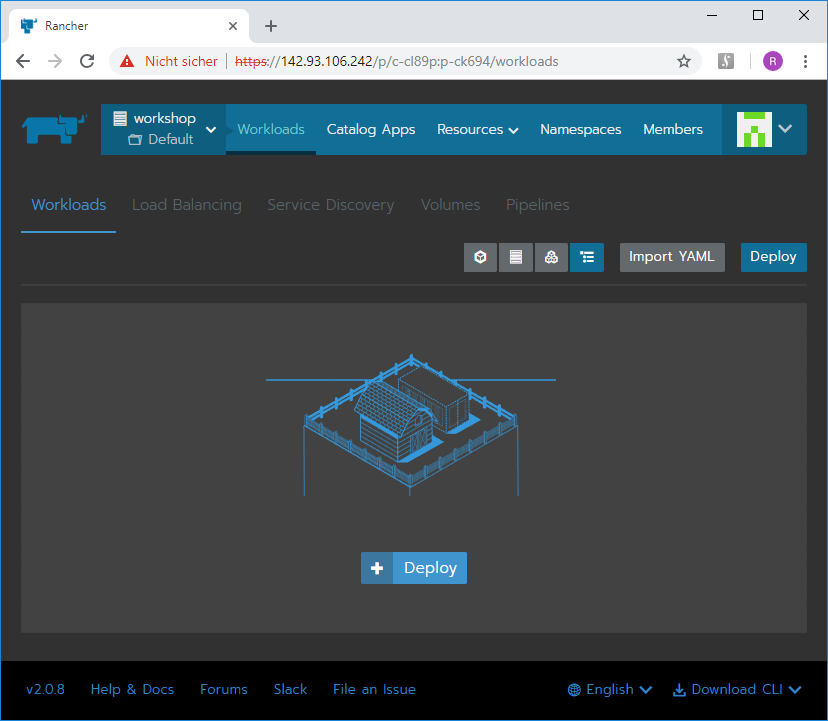
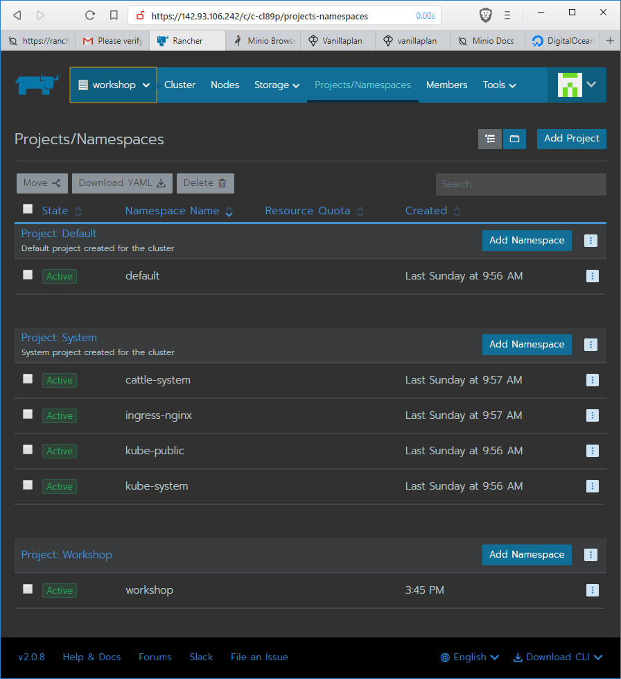
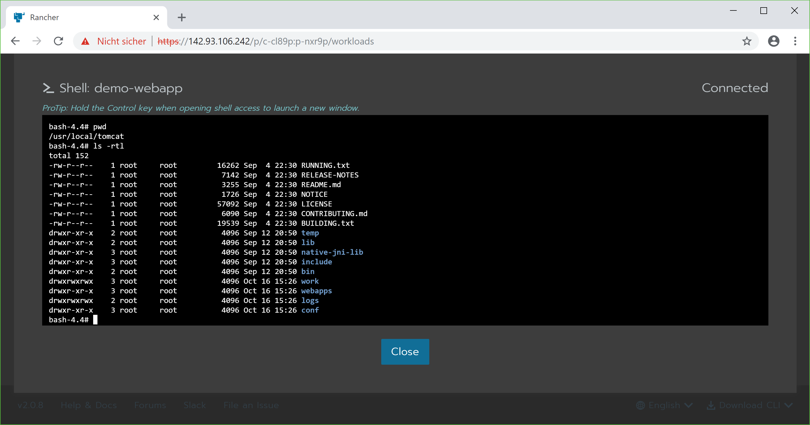

stateless workloads
===================

once we have a cluster running, we can start caring about creating k8s objects. there are plenty of them, but we start
with some simple but useful ones. a so-called *stateless* workload is one that has no persistent storage and can be
simply reconstructed by running an instance of its image. hence it is completely disposable.

goals
-----

in this section we are looking to achieve the following goals:

* start a 'hello world' container as a proof of concept
* use a node port to access it
* launch an [nginx](https://www.nginx.com/) web server (in real-world scenarios, some content must be added)
* start a simple demo webapp from a custom docker registry
* add an ingress to access it
* start a shell in the webapp container
* look at logs
* scale the webapp
* kill the webapp and see what happens
* add a health check

although this list is a bit lengthier than the previous ones, we will probably progress quite quickly through it,
as most items are quite straight forward,

the first workload
------------------

to warm up, we start by running the [rancher version of the ubiquitous 'hello world' program](https://github.com/rancher/hello-world).
in the rancher gui, we look for our new cluster on the `Global` dropdown. below its name, we see two more items,
namely `Default` and `System`. These are so-called *projects*, which are rancher-managed objects that basically
represent a collection of k8s namespaces to which users and roles can be assigned. if we click on the item
`Default` below our cluster, we see a nice picture with cube having a farm house and a container on the top
(if you see something else, you might have to click on `Workloads` first).

as you might guess, we can just deploy a workload by clicking the `Deploy` button. to start our very first workload,
we click this button and enter just the name `hello-world` and the image `rancher/hello-world` into the subsequently appearing page:

click on `Launch` to launch it. done. on the list of workloads that appears now we can see the newly created item
and its status, which should quickly change from `Updating` to `Active`, and simultaneously on the right side a
bar changing from red to light green showing an overview of the pods that belong to the workload.

nice, it runs. but what can we do with it? just right of the pod overview bar, there is a three dot menu, on which we click now.
this unfolds a list of available actions (as expected), with `Edit` as the first entry. if we click on `Edit`, we see
pretty much the same page as the one on which we initially created the workload, except name and namespace are now read-only.
to make the hello world app visible, we add a port mapping by clicking on `Add Port`. in the appearing line, we enter the
following parameters (from left to right):

* **container port:** 80 - this is the port that is exposed by the container, i.e. the one on which the webapp itself listens
* **protocol:** tcp (leave as is)
* **as a:** change to `HostPort (On every node)` 
* **listening port:** leave as `Random` - this is the port through which we can access the webapp from the internet

now click on the `Update` button at the bottom to upgrade the workload. after a short phase in `Updating` state we get
back to an `Active` workload, this time with a link below the workload's name:

to see the webapp, just click on this link.

***note:*** as we have mapped a host port (even though a random one), we must use a non-default upgrade policy, namely
`Rolling: stop old pods, then start new`. as we don't plan to upgrade the first workloads anyway, we can safely ignore this
for now. in most cases it is not recommended to use mapped host ports anyway.

run nginx
---------

even though it looks quite nice, this webapp is not a very useful workload. let's proceed to run a more realistic
workload, namely the [nginx](https://www.nginx.com/) web server. in a real-world scenario, you will have to
customize the image by adding some content and/or modifying the configuration.

click the `Deploy` button (this time on the right side above the list of workloads), but this time enter `nginx` both as name and as image:

again, we add a port mapping to port 80. guess what we see after the state is changing to `Active`?

see also:

* https://www.nginx.com/
* https://hub.docker.com/_/nginx/

simple demo webapp
------------------

this time, we run a demo webapp specifically created to illustrate container management tools.
it has some features like:

* can be killed
* can be rendered unhealthy

to illustrate more realistic deployment scenarios, we install it from a private (i.e. password protected) registry
and deploy it in a separate project and namespace.

add a project and a namespace
-----------------------------

on the `Global` toolbar item (which now displays your cluster name and the `Default` project below it), select your
cluster, which gives a toolbar button named `Projects/Namespaces`, which we click now. on the appearing
list of initial projects (`Default` and `System`) and their namespaces, you find a button named `Add Project`.
add a project named `Workshop` (starting with upper case) then using `Add Namespace` a namespace named `workshop` (starting with lower case).

navigate to the newly created project using the `Global` dropdown and click on `Workloads`.

add a private registry
----------------------

it is publicly available both on [github](https://github.com/Remigius2011/webapp-hello-java) and on [docker hub]().
during the workshop, I have also deployed it on a private registry which we can now add to our rancher server.
on the `Resources` dropdown, click on `Registries`:

then on `Add Registry`, which displays the following page to enter the parameters:

* **name:** `rancherws-hub`
* **address:** select `Custom` and enter `rancherws-hub.descom-consulting.ch:443`
* **credentials:** user: `rancher`, password will be given to workshop participants

then click `Save` to save the registry parameters.

run the webapp
--------------

now you are ready to deploy the demo webapp by clicking the `Deploy` button. initially, enter the following parameters:

* **name:** `demo-webapp`
* **namespace:** verify it is `workshop` (the newly created one - must belong to the project in which the private registry was defined)
* **image:** `rancherws-hub.descom-consulting.ch:443/demo:fce3132d7d`

after clicking `Launch`, you see the usual status changes during the deployment until the workload reaches `Active` state.

add an ingress
--------------

the workload is not yet accessible as we did not add a node port mapping. this time, we add a so-called *ingress* instead.
an ingress is a rancher managed instance of an `nginx` server (L7 ingress) or - if available for the cloud provider on which the cluster
was deployed - as a hardware load balancer acting as a reverse proxy (L4 ingress - also managed by rancher).

to create one, click on `Load Balancing` and on the `Add Ingress` button. on the ingress page, enter the following parameters:

* **name:** `demo-webapp`
* **namespace:** verify it is `workshop` (the newly created one - must be same as the namespace of the workload)
* **target:** `demo-webapp` - the workload from the previous step
* **rules:** leave the default `Automatically generate a .xip.io hostname` selected
* **port:** 8080 - the port exposed by the container, i.e. the port on which the webapp listens

after clicking on `Save` you see the ingress on the list under `Load Balancing` and after waiting for a little while,
a link appears as follows (initially, it is just `xip.io`, which points nowhere):

by clicking on the link, you can now navigate to the webapp. the webapp displays the current server time as well as
the host name of the app. when you refresh the page, you see the time changing but everything else staying unchanged.

***note:*** on the ingress page, you are able to define a host name and ssl/tls certificates for the workload.
the options for the host name are either to create one on xip.io, which is useful for testing/demo purposes
mut highly discouraged for production workloads. you can also enter a host name, in which case you must also provide
a corresponding entry in the dns of the respective domain. as a third option, you can choose to use the ingress as
default backend, which routes all requests that don't target a known host name to this workload. the ingress listens on
port 80 fot `http` and - with a certificate - on port 443 for `https` requests. if you want to use `https`, you have to
provide a valid ssl/tls certificate. such certificates must be added to the project using `Resources -> Certificates`
before they can be used. alternatively, you can deploy a reverse proxy as an end-point for `https` requests and
route requests to workloads internally using `http`.

once the app is running, we can start a shell using the three dot menu either for the whole workload or for a pod.
just click on the menu entry `Execute Shell`:

which starts a shell window:

if yon need to check the state of a pod (filesystem, environment etc.) you can easily achieve this using the shell.
as also `wget` is available, you can easily pull some files into your pods if necessary, e.g. to load some data into
a database.

***caveat:*** don't change the internal state (e.g. configuration files) using the shell except for experiments - this leads to non
reproducible pods. rather change the image used to create the pod (create your own dockerfile if necessary).

we can also watch its log using the three dot menu entry `View Logs` available for each pod (click on the
workload name in the workload list to inspect its details, the pods are on the top).

scale the webapp
----------------

one of the things we want to achieve by using clusters is horizontal scaling of our workloads. using rancher, this is fairly simple.
navigate to the workload list of the `Workshop` project (you should know by now how to find it - otherwise just click around a bit).
option one to scale the workload is entering the dot menu on the right side, changing the number of pods under `Workload type` to 3 and clicking `Upgrade`.
after a little while, you see the change in the number of pods. when you click on the workload's name, you see the list of actual pods.

another possibility to scale the workload is by clicking on the `+` and `-` buttons above the list of pods.
k8s automatically schedules the pods on the available cluster nodes.

***note:*** if we want to scale the webapp, we need to use an ingress, as otherwise we risk to have
ports that are already occupied when a second instance of the workload is created on the same node.
as each pod has its own ip address in the internal k8s network, port conflicts are avoided and the default
upgrade policy `Rolling: start new pods, then stop old` can safely be used.

now, as we have 3 pods running the webapp the list of pods has grown. also, if we now refresh the webapp,
not only the time but also the host name changes.

self healing
------------

k8s provides means to automatically keep your workloads running if failures occur. there are mainly two features for this:

* restarting pods if they stop
* health checks

the demo webapp contains means to play with these, which are:

* a `/kill` entry point that causes the app to terminate (which also terminates the pod)
* a `/sick` entry point that toggles the health state of the app
* a `/health` entry point that can be used as a health check - it returns a failure http state if the app is unhealthy

lets start by killing the app using the link `kill server`. as soon as the app is killed, rancher starts a new pod using the current
parameter set as can be seen when watching the `Workload` list. as the set of pods is redundant, the app stays available (unless all
pods are killed in fast sequence).

if we use the link `make server sick`, the health state is toggled, which is displayed on its top page, but other than
that nothing happens. in order for rancher to react on the health state, we must first add
a health check to the workload by editing its parameters. add the following parameters in the health check section:

* **Readiness Check:** choose `HTTP request returns a successful status (2xx or 3xx)`
* **Request Path:** enter the url path of the health check entry point `/health`
* **Target Container Port:** enter 8080 (the port on which the application listens)
* **Start Checking After:** enter at least 20 (seconds) to leave enough time to start the webapp

there are also other types of health checks than http(s) requests (tcp connection and shell command), ut typically
for a web application it is easiest to provide a http(s) entry point for this purpose.

now click the `Upgrade` button.

after the pods are updated, you can now click the link `make server sick` again and see what happens with the pods.
one of the pods eventually gets unhealthy. if you keep refreshing the webapp's main page it is highly unlikely you
will ever see it in unhealthy state, as the ingress routes incoming requests only to healthy pods. but for some time
only two host names are observable until eventually the third one comes back to life.

***note:*** it is advisable to add a health check to your webapp. if yo, add checking connections to external systems
(e.g. database) if they are essential for the app. it might be better to use a more stealth name for the health check
entry point if you don't want to disclose the health state of your app to arbitrary visitors, like e.g. `/health3o2352oi3u5zoiu` or similar.
if you choose to add health and/or kill switches to your app, it might be better to have them disabled in a production
deployment. if new pods are often unhealthy, just augment the value of the initial delay in
`Start Checking After` until it fits.

***note:*** it is a known problem that "Creation of SecureRandom instance for session ID generation using [SHA1PRNG]"
in tomcat may take a lot of time (sometimes several minutes) due to running on a vm, which means there it not a lot of
entropy available by default. obviously this may cause the health check to fail for quite some time.
this problem can be fixed by adding [haveged](http://www.issihosts.com/haveged/) to the vm. it looks like `haveged` can also be
installed in docker images, but i haven't tried this yet.

see also:

* https://stackoverflow.com/questions/40383430/tomcat-takes-too-much-time-to-start-java-securerandom
* http://www.issihosts.com/haveged/
* https://github.com/harbur/docker-haveged
