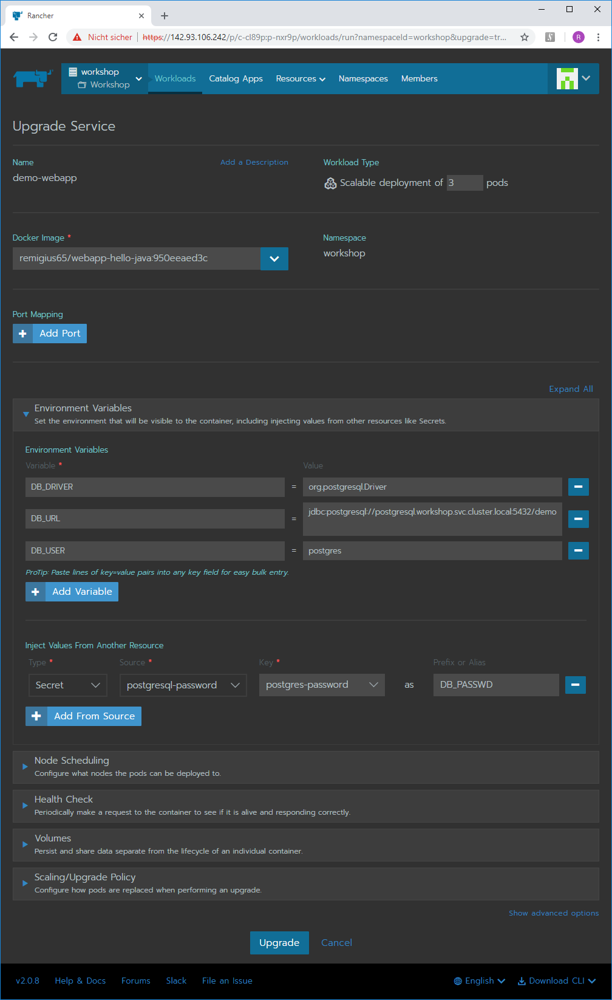
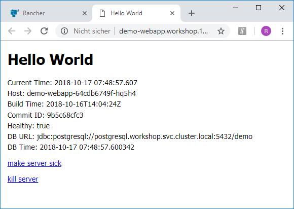

stateful workloads
==================

once we have seen how simple stateless workloads can be deployed on rancher, we look at more intricate scenarios
that can be used as a starting point for running complete web applications composed of multiple cooperating containers.

goals
-----
 
in this section we are looking to achieve the following goals:

* learn about k8s volumes to provide persistent storage
* learn about configuration: environment variables, config maps and secrets
* learn about catalog apps
* create persistent storage and a secret with credentials for a database server
* run postgresql as a catalog app
* access `psql` on the postgresql server
* add pg-admin 4
* ***coming soon:** restore a dump to the postgresql server using `kubectl` and `pg_restore`*
* ***coming soon:** add pg_dump backups as a cron job*
* ***coming soon:** add [minio](https://www.minio.io/) (an s3 compatible back-end) as target for collecting dump files*

persistent storage in k8s
-------------------------

nowadays, several web applications run solely using clustered in-memory databases. bit there are some die-hard
traditionalists (like me or possibly your boss) who want to have data persisted - maybe even n another data center
in case the main one gets nuked accidentally (regards from kim and donald).

for these cases we need persistent storage. k8s provides a set of object tpyes that provide very flexible means of
using persistent storage for pods, which are:

* **persistent volumes (PV):** an abstraction for a piece of block store made available to a pod
* **persistent volume claims (PVC):** a request to get a *persistent volume* which will eventually be bound to one
* **storage class:** parameters to provide persistent storage on demand (i.e. dynamically)

a pvc is using one of the available pv or storage classes. it is bound to the
respective block store and can be reused by newly created pods depending on the specified access mode.
there are three access modes:

* **Single Node Read-Write (aka ReadWriteOnce / RWO):** the volume can be mounted as read-write by a single node
* **Many Nodes Read-Only (aka ReadOnlyMany / ROX):** the volume can be mounted read-only by many nodes
* **Many Nodes Read-Write (aka ReadWriteMany / RWX):** the volume can be mounted as read-write by many nodes

the concrete implementation of persistent storage is provided by a storage driver. there are many different storage
drivers, some providing local storage on the node a pod is running on (local disk, local path), some allow accessing
network storage (nfs, iscsi) or even distributed file systems (ceph, gluster, longhorn). obviously there are also drivers for
attachable block store of cloud providers (amazon ebs disk azure disk, google persistent disk etc.)

typically, you can leave the access mode in rancher to its default, which is RWO, but in any case you must make sure
the access mode of the pvc corresponds to the one of the pv.

the available access modes depend on the driver, a list can be found [here](https://kubernetes.io/docs/concepts/storage/persistent-volumes/#access-modes).

note that persistent volumes and storage classes are defined in rancher for an entire cluster, whereas
persistent volume claims are defined on project level.

see also:

* https://kubernetes.io/docs/concepts/storage/volumes/
* https://kubernetes.io/docs/concepts/storage/persistent-volumes/

https://hub.docker.com/r/dpage/pgadmin4/

configuration
-------------

there are two k8s object types usable for configuring workloads, which are:

* **configmap:** a named set of name-value pairs that can be passed to pods as environment variables or mounted in a volume
* **secret:** same as configuration map, but stored encrypted

mounted configmaps and secrets are updated automatically, whereas environment variables keep their values during the runtime
of a pod.

both configmaps and secrets can be made available in rancher for entire projects or restricted to a namespace.

environment variables can also explicitly be specified when creating a workload. when creating a sete of environment values,
you can paste a multiline text fragment containing all `name=value` pairs in one operation, e.g.:

```
NAME1=value1
NAME2=value2
NAME3=value3
```

see also:

* https://kubernetes.io/docs/concepts/configuration/overview/
* https://kubernetes.io/docs/concepts/configuration/secret/

add db node
-----------

no we are ready to prepare launching a database server. as a first step, we add a slightly more powerful node than the worker nodes.
we perform the following steps:

* on the cluster level, click `Nodes` and `Edit Cluster`
* in the node roles section, add a new line by clicking on the `Add Node Pool` button
* add a new node pool with name prefix=`db-`, count=1 and only the worker role
* add a new node template with the same parameters as the first one (namely in the same region as the rest of the cluster!),
  except for droplet size, where you choose 4GB / 80GB / 2vCPUs. name it accordingly
* add a label with name `type` and value `db` to be able to recognize the new node as db node
* click on `Create` to save it
* select this template for the new node
* update the cluster by pushing the `Save` button

after a while the node should be available and green (i.e. in `Avtive` state) in the node list.

catalog apps
------------

catalog apps are predefined sets of k8s objects of possibly multiple types. these are implemented as so-called
helm charts, which are in turn sets of templates to create the k8s objects. in rancher there are some predefined
app catalogs as well as. check the `Global` toolbar item `Catalogs` to enable the catalogs you need (e.g. `Helm Stable` or
`Helm Incubator`) or to add custom helm charts (provided as git repos or server urls). this allows you to create your own
helm charts if necessary.

in order to deploy `postresql`, the `Helm Stable` catalog must be enabled.


prepare postgresql deployment
-----------------------------

in order to deploy a `postgresql` database, we need to create the following objects before we can start it from the catalog:

* persistent storage: a pv and a pvc
* a secret containing the admin credentials

to create a pv, we use the menu entry `Persistent Volumes` in the `Storage` dropdown in the cluster's toolbar.
to create a new persistent volume, click on the button `Add Volume` on the right side above the (now empty) volume list,
which leads you to the volume page. there you can enter the following parameters to create a persistent volume
that uses the local file system of the db host:

* **Name:** `postgresql-data`
* **Volume Plugin:** select `Local Node Path` from the dropdown
* **Path on the Node:** enter a absolute path, e.g. `/data/postgresql`
* **The Path on the Node must be:** select `A directory, or create if it does not exist`

then click `Save` to save the persistent volume. now navigate to the project `Workshop` to create the pvc
on the `Workloads` page click on `Volumes`, then on the button `Add Volume`, which displays the volume page
where you can enter the following parameters:

* **Name:** `postgresql-data`
* **Namespace:** `workshop` (use the same namespace you also intend to use for the database)
* **Source:** choose `Use an existing persistent volume`
* **Persistent Volume:** select the newly created pv `postgresql-data`

then click `Create` to create the pvc. its state should immediately change to `Bound` (green).

create a secret for admin credentials
-------------------------------------

on the project level, we use entry `Secrets` of the the dropdown `Resources`, then click on `Add Secret` to create a new secret.
in the appearing page we enter the name `postgresql-password` and a single entry with name=`postgres-password` and random characters
as its value.


the name of the password parameter is determined by the helm chart and thus cannot be changed, the name of the secret itself
can be chosen arbitrarily but will be used when launching the postgresql server.

deploy a postgresql database
----------------------------

on the project level, click on the toolbar button `Catalog Apps`, then on `Launch` to see a list of available
catalog apps. if you have already enabled `Helm Stable` (*pun warning:* a stable of helm apps...), there should be plenty
of them. type `post` into the search field, which quickly restricts the list of visible entries. enter the entry
for `postgresql (for Helm)` by clicking on `View Details`. on the appearing page, you can open the section
`Detailed Descriptions` to review the description of the helm chart. there is a list of available parameters,
to which you can assign values (answers) by entering `name=value` pairs using the button `Add Answers`.

take a minute or so to browse the available parameters. the postgres helm chart provides a parameter that contains the
image name called `image` (defaults to `postgres`) as well as a parameter called `imageTag` (defaults currently to `9.6.2`)
that can be used to instantiate a database server using another postgresql version from the official repo or
even a custom one that is derived from the official image, e.g. to add a database and its schema.
enter `postgresql` into the `name`field, click on `customize` then on `Use an existing Namespace` to select the target
namespace for the postgresql server, which should be `workshop`.

now copy the following list into a text editor and adapt the values according to your needs (for the workshop
you can also leave the list as-is if you followed the previous instructions closely - especially the names of the
secret and the pvc):

```
existingSecret=postgresql-password
imageTag=9.6.2
nodeSelector.type=db
persistence.existingClaim=postgresql-data
postgresDatabase=demo
```

the parameter `imageTag` is configured here to its default value just to have it present for a later change. the
parameter `nodeSelector.type` refers to the label `type=db` we have added to the new node template for the db node.
`demo` is the name of a database that will be created automatically on first launch of the server.
to use the values, click on `Add Answers` and paste the whole list into the first `name` field.

the result should now look as follows:


click on `Launch` to launch the server.

if all goes well, you will end up having a running postgresql server in your cluster.

to prove that the server is functional, we can access it using `psql` in a shell opened on the `postgresql` pod.
on the `Workloads` list of the `Workshop` project, click on the name of the `postgresql` workload to see its single pod,
then open the shell via the three dot menu beside the pod. alternatively, you can see the pod by entering the details
of the catalog app entry. once the shell is opened, just enter `psql` (as you are root, there is no need to enter a password):


obviously, other tools like `pg_dump` and `pg_restore` are also available, but `wget` and `curl` are missing.

access the database
-------------------

obviously, we don't just install a database for the fun of it, but to use it in a webapp. fortunately, the
demo webapp we have already running (should be in the same namespace or atg least in the same project as the
database if you have followed the instructions closely enough), is prepared for this. we just need to add
some environment variables so it can connect to the database.

in its raw state - as we did not specify the catalog app to use a n ode port - is only accessible internally.
each pod is assigned its proper ip address, which we can lookup either by checking the list of workloads in the
namespace `workshop` (there is just one pod running `postgresql`) or by clicking on the app's name in the
now running catalog app, which opens a page that displays its current state (including details of some created cluster objects).
also, there is a service created for `postgresql`, which is in turn assigned an internal dns name. therefore we can access
the database in two ways:

* by the pod's IP address
* by the service's dns name

the service's dns name is obviously the better choice as it will stay the same even if the database server is running
in a new pod (e.g. after an upgrade). the dns names that are assigned to service by k8s follow this naming scheme:

`my-svc.my-namespace.svc.cluster.local`

now we can proceed to add the necessary environment variables to our demo webapp's workload entry
(use `Edit` from the three dot menu and unfold the `Environment Variables` section):

```
DB_URL=jdbc:postgresql://postgresql.workshop.svc.cluster.local:5432/demo
DB_DRIVER=org.postgresql.Driver
DB_USER=postgres
```

in addition to this, we add the previously defined database password from the existing secret by clicking
`Add from Source`, selecting our secret, its parameter name as `key` and entering `DB_PASSWD` as `Prefix or Alias`



as usual, click `Upgrade` to upgrade the workload. after a while, the rolling upgrade finishes and the new version
is deployed in the chosen scale.

if all went well, the demo webapp now displays the database url and the current time from the database server (which changes on refresh):



see also:

* https://kubernetes.io/docs/concepts/services-networking/service/
* https://kubernetes.io/docs/concepts/services-networking/dns-pod-service/

launch pg admin
---------------

as we have seen, it is easily possible to perform db maintenance tasks using `psql` on a shell and for some bm admins
this is completely sufficient. but for folks (like me) who prefer a gui sometimes, there is [pgadmin 4](https://www.pgadmin.org/)
to the rescue.

as for many apps, there is also a ready-made [docker image  for pgadmin 4](https://hub.docker.com/r/dpage/pgadmin4/)
available on docker hub, which makes the task to launch it as easy as adding a new workload and an ingress for it.

the workload needs some environment (`PGADMIN_DEFAULT_EMAIL=admin@localhost` as the admin login user's email and the
`postgres-password` from the secret as `PGADMIN_DEFAULT_PASSWORD` - feel free to add another secret) as well as a
name (`pgadmin`) and the image (`dpage/pgadmin4`):


the ingress is straight forward (enter the name, select the namespace `workshop` and enter the exposed port 80):


as soon as the full `xip.io` link is displayed, xou can start `pgadmin 4` and log in with the specified credentials.


to access `postgresql` you must connect to a server. use the host name `postgresql.workshop.svc.cluster.local`
and the admin credentials for the database.


now you can verify the specified database named `demo` was created:


